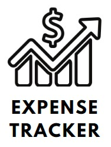
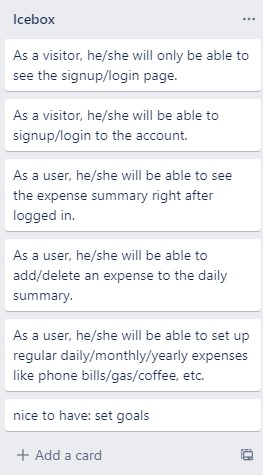
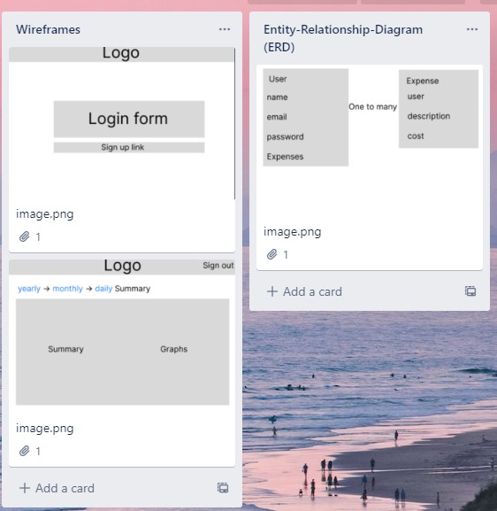

 

  
     
     
<h1 align="center">Expense Tracker</h1>
  

    <a href="https://github.com/lolo19950603/expense-tracker"><strong>< Link to repo ></strong></a>
    <a href="https://expense-tracker-production-6f0d.up.railway.app/"><strong>< Link to app ></strong></a>

<!-- TABLE OF CONTENTS -->

  <h2>Table of Contents</h2>
  <ol>
    <li>
      <a href="#about-the-project">About</a>
    </li>
    <li><a href="#roadmap">Roadmap</a></li>
    <li><a href="#issues">Issues or Enhancements</a></li>
    <li><a href="#contributing">Contributing</a></li>
    <li><a href="#contact">Contact</a></li>
    <li><a href="#acknowledgments">Acknowledgments</a></li>
  </ol>

<!-- ABOUT -->

## About

  <h2>THE PLAN BREAKDOWN</h2>
   
  
   
  
   

(<a href="#readme-top">back to top</a>)

### Built With

- MongoDB/Mongoose
- Express
- Trello
- Github
- Visual Studio
- JavaScript
- React.js

(<a href="#readme-top">back to top</a>)

<!-- ROADMAP -->

## Roadmap

- Registration Features (setting up the project)
- Add transaction index list
- Add transaction form
- Add daily/monthly total spending
- Add-History Tracker to see what your have spend in the past

## Issues or Enhancements

- Issue - was having issue with useEffect where the componect is only rendered once but needs to be re-rendered when new form is submitted.

- Enhancement - didn't have time to implement the delete button.

(<a href="#readme-top">back to top</a>)

<!-- CONTACT -->

## Contact

Loren Chen : [@Facebook](https://www.facebook.com/loren.chen1/) --- [@Linkedin](https://www.linkedin.com/in/loren-chen-6258b7125/) --- [@Twitter](https://twitter.com/Colton_Rennie90) --- loren840603@gmail.com

(<a href="#readme-top">back to top</a>)

<!-- ACKNOWLEDGMENTS -->

## Acknowledgments

- [GeneralAssembly](https://generalassemb.ly/)
- [Denis Dujota- Instructor @ GA](https://github.com/Dujota)

(<a href="#readme-top">back to top</a>)

[trello.com]: https://img.shields.io/badge/Trello-0052CC?style=for-the-badge&logo=trello&logoColor=white
[trello-url]: https://trello.com/
[github.com]: https://img.shields.io/badge/github-000000?style=for-the-badge&logo=github&logoColor=white
[github-url]: https://github.com/
[visualstudio.com]: https://img.shields.io/badge/visualstudiocode-007ACC?style=for-the-badge&logo=visualstudiocode&logoColor=white
[visualstudio-url]: https://code.visualstudio.com/
[materializecss.com]: https://img.shields.io/badge/materializecss-ee6e73?style=for-the-badge&logo=monster&logoColor=white
[materializecss-url]: https://materializecss.com/
[djangoproject.com]: https://img.shields.io/badge/Django-092e20?style=for-the-badge&logo=Django&logoColor=white
[django-url]: https://djangoproject.com/
[python.org]: https://img.shields.io/badge/python-3776AB?style=for-the-badge&logo=Python&logoColor=white
[python-url]: https://www.python.org/
[javascript-url]: https://www.javascript.com/
